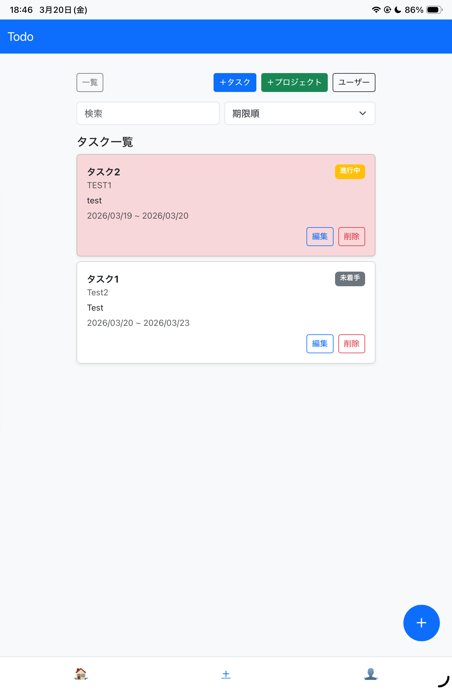
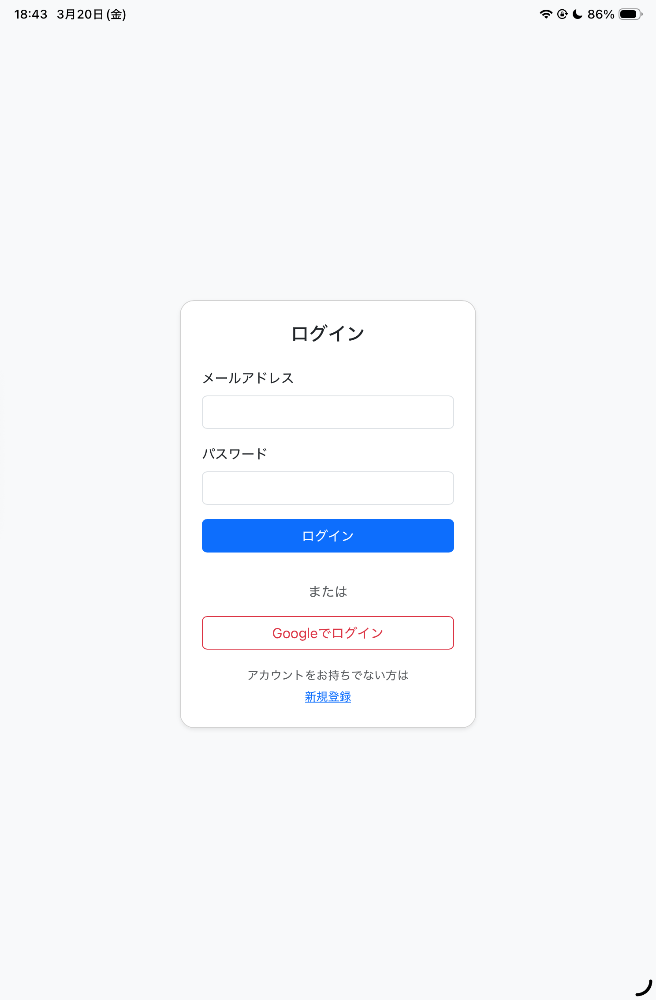
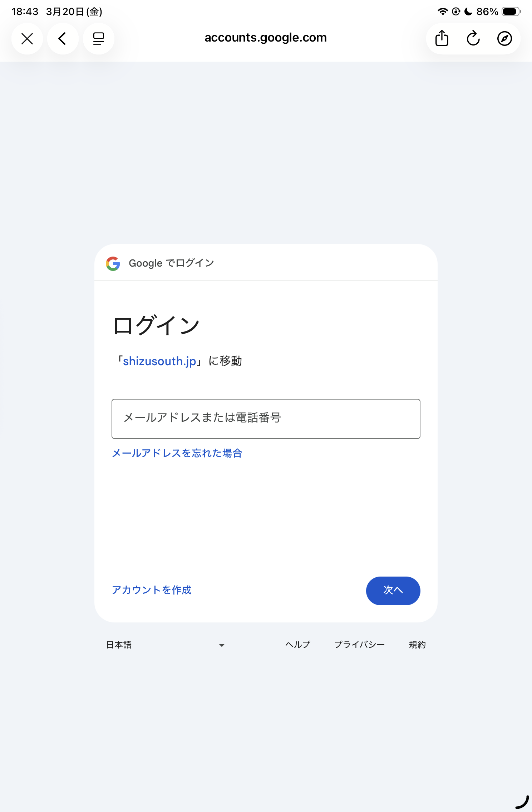

# Todo App

## 🔗 アプリURL
https://todo.shizusouth.jp

---

## 📝 概要
PHPで作成したタスク管理アプリです。  
ユーザー登録・ログイン機能に加えて、Googleアカウントを利用したOAuthログインにも対応しています。

日々のタスクをシンプルに管理できることを目的として開発しました。

---

## 📸 スクリーンショット

### タスク一覧


### ログイン画面


---

## ⚙️ 主な機能

- ユーザー登録 / ログイン / ログアウト
- Googleログイン（OAuth認証）
- タスクの追加 / 編集 / 削除
- プロジェクトごとのタスク管理

---

## 🛠 使用技術

- PHP（ネイティブ）
- MySQL
- JavaScript
- Composer
- Google API Client（OAuth認証）

---

## 💡 工夫した点

- Google OAuthログインを実装し、ユーザー登録の手間を減らした
- セッション管理によりログイン状態を適切に保持
- `env.php` による機密情報の分離を行い、セキュリティを意識した設計
- GitHubのPush Protectionに対応し、secret情報をリポジトリから除外

---

## 🧠 苦労した点

- OAuth認証における `redirect_uri_mismatch` エラーの解決  
- 本番環境で発生した HTTP 500 エラーの原因特定と修正  
- PHPのDeprecated警告による `header` エラーの対応  
- GitHubのPush Protectionによるpush拒否の対応（secret管理）

---

## 🔍 技術選定の理由

### PHPを選択した理由
学習コストが低く、Webアプリ開発の基礎（セッション・DB接続など）を理解するのに適しているため採用しました。

### フレームワークを使わなかった理由
まずはネイティブPHPでWebアプリの仕組みを理解することを目的としたためです。

---

## 🔐 セキュリティ対策

- 機密情報（DB接続情報・OAuthキー）をコードから分離
- セッション管理による認証制御
- 基本的な不正アクセス対策を実施

---

## 🚀 セットアップ方法

```bash
git clone https://github.com/supica8219/Todo.git
cd Todo
composer install